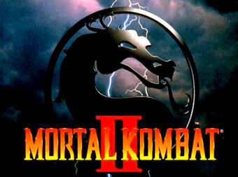

# Mortal Kombat II: RISC-V

Trabalho final de OAC: Mortal Kombat II

## Navegação e movimentação
**Navegação**: ao iniciar o jogo, o jogador se depara com as telas de menu. A navegação pode ser feita pela teclas <kbd>w</kbd> (para cima), <kbd>s</kbd> (para baixo), <kbd>f</kbd> (selecionar) e <kbd>g</kbd> (voltar).

**Movimentação**
| Tecla | Ação                |
|-------|---------------------|
| a     | andar para esquerda |
| d     | andar para direita  |
| j     | socar               |
| k     | chutar              |
| B     | golpe fatality      |
